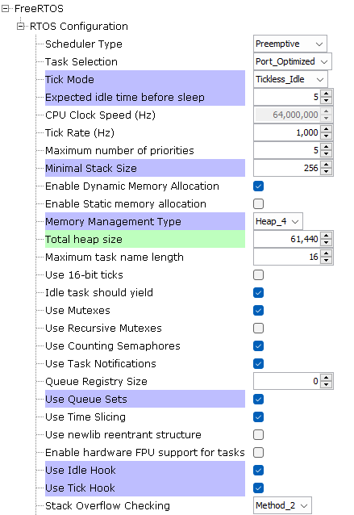

# PIC32CXBZ2_WBZ45x Thread Co-Processor

> "IoT Made Easy!" 

Devices: **| PIC32CXBZ2 | WBZ45x |** 
Features: **| OpenThread |**

## ⚠ Disclaimer

<b>
THE SOFTWARE ARE PROVIDED "AS IS" AND GIVE A PATH FOR SELF-SUPPORT AND SELF-MAINTENANCE. This repository contains example code intended to help accelerate client product development.  

For additional Microchip repos, see: <a href="https://github.com/Microchip-MPLAB-Harmony" target="_blank">https://github.com/Microchip-MPLAB-Harmony</a>

Checkout the <a href="https://microchipsupport.force.com/s/" target="_blank">Technical support portal</a> to access our knowledge base, community forums or submit support ticket requests.

</b>

## Contents

1. [Introduction](#step1)
1. [Bill of materials](#step2)
1. [Software Setup](#step3)
1. [Harmony MCC Configuration](#step4)
1. [Board Programming](#step5)
1. [Run the demo](#step6)

## 1. Introduction<a name="step1">

This application enables the users to create a Thread Co-Processor on Full Thread Device. Thread Co-Processor is a supporting implementation to develop a Gateway Application on an other Host processor.

Supported Propreitary Device Types: 
    1. [Thread temperature sensor](https://github.com/MicrochipTech/PIC32CXBZ2_WBZ45x_THREAD_TEMPERATURE_SENSOR) 
    2. [Thread Thermostat](https://github.com/MicrochipTech/PIC32CXBZ2_WBZ45x_THREAD_THERMOSTAT) 
    3. [RGB Light control](https://github.com/MicrochipTech/PIC32CXBZ2_WBZ45x_THREAD_LIGHTING) 
    4. Garage Control ** 
    5. Solar Control ** 

** - Details will be updated soon.

| Tip | Go through the [overview](https://onlinedocs.microchip.com/oxy/GUID-2DB248AF-C243-496D-9819-969E43CA63BC-en-US-1/GUID-162D7BE7-3A35-4D12-AE09-EE84C6554377.html) for understanding few key Thread protocol concepts |
| :- | :- |

## 2. Bill of materials<a name="step2">

| TOOLS | QUANTITY |
| :- | :- |
| [PIC32CX-BZ2 and WBZ451 Curiosity Development Board](https://www.microchip.com/en-us/development-tool/EV96B94A) | 1 |

## 3. Software Setup<a name="step3">

- [MPLAB X IDE ](https://www.microchip.com/en-us/tools-resources/develop/mplab-x-ide#tabs)

    - Version: 6.20
    - XC32 Compiler v4.40
    - MPLAB® Code Configurator v5.5.0
    - PIC32CX-BZ_DFP v1.2.243
    - MCC Harmony
      - csp version: v3.18.5
      - core version: v3.13.4
      - bsp version: v3.18.0
      - CMSIS-FreeRTOS: v11.1.0
      - dev_packs: v3.18.1
      - wolfssl version: v5.4.0
      - crypto version: v3.8.1
      - wireless_pic32cxbz_wbz: v1.3.0
      - wireless_15_4_phy version: v1.1.1
      - wireless_thread: v1.0.1
      - openthread version : mchp_harmony_wireless_thread_v1.0.0

- Any Serial Terminal application like [TERA TERM](https://download.cnet.com/Tera-Term/3000-2094_4-75766675.html) terminal application

- [MPLAB X IPE v6.20](https://microchipdeveloper.com/ipe:installation)

## 4. Harmony MCC Configuration<a name="step4">

### Getting started with Thread Co-Processor application in WBZ451 Curiosity board 

| Tip | New users of MPLAB Code Configurator are recommended to go through the [overview](https://onlinedocs.microchip.com/pr/GUID-1F7007B8-9A46-4D03-AEED-650357BA760D-en-US-6/index.html?GUID-B5D058F5-1D0B-4720-8649-ACE5C0EEE2C0) |
| :- | :- |

**Step 1** - Connect the WBZ451 CURIOSITY BOARD to the device/system using a micro-USB cable.

**Step 2** - Create a [new MCC Harmony project](https://github.com/MicrochipTech/EA71C53A/blob/master/H3/wireless_apps_pic32cxbz2_wbz45/apps/docs/creating_new_mplabx_harmony_project.md#creating-a-new-mcc-harmony-project).

**Step 3** - The "MCC - Harmony Project Graph" below depicts the harmony components utilized in this project.

- From Device Resources, go to Libraries->Harmony->Board Support Packages and add WBZ451 Curiosity BSP.
 
- From Device Resources, go to Libraries->Harmony->Wireless->Drivers->Thread and add Thread Stack. Click "Yes" on all the Pop-ups to add the link the dependencies.

- Ensure the configuration of Thread Stack is as below.

- Ensure the configuration of FreeRTOS is as below. Total heap size should be 61440.

- In FreeRTOS configuration options, go to RTOS Configurations->Include components and make sure xTaskAbortDelay is selected.

- From Device Resources, go to Libraries->Harmony->System Services and add COMMAND. Ensure the below configuration.

- Right Click on SYS_CONSOLE of COMMAND and add CONSOLE as below. Ensure the configurations.

- Right Click on UART of CONSOLE and add SERCOM0 as below. Ensure the configurations.

- Modify the System Configuration as below.

**Step 4** - [Generate](https://onlinedocs.microchip.com/pr/GUID-A5330D3A-9F51-4A26-B71D-8503A493DF9C-en-US-1/index.html?GUID-9C28F407-4879-4174-9963-2CF34161398E) the code.
 
**Step 5** - In "app_user_edits.c", make sure the below code line is commented 

- "#error User action required - manually edit files as described here".

**Step 6** - Copy the mentioned files from this repository by navigating to the location mentioned below and paste it your project folder. 

| Note | This application repository should be cloned/downloaded to perform the following steps. |
| :- | :- |

- Copy "Thread_demo.c" and "Thread_demo.h" files available in "...firmware\src"
- Paste the files under source files in your project folder (...\firmware\src).

**Step 7** - Add the files in MPLAB X IDE to your project by following the steps mentioned below.

- In Projects section, right click on Source files to add the ".c" file and Header files to add the ".h" file.
- Select "Add existing item".
- Select Add and browse the location of the mentioned files(...\firmware\src). 
- Make sure the "Files of type" is "C Source files" while adding ".c" files and "Header files" while adding ".h" files.
- Select the folder and click "add".

**Step 6** - Copy the mentioned files from this repository by navigating to the location mentioned below and paste it your project folder. 

| Note | This application repository should be cloned/downloaded to perform the following steps. |
| :- | :- |

- Copy "app.c" and "app.h" files available in "...firmware\src"
- Paste the files under source files in your project folder (...\firmware\src).

- Copy the "sys_command.c" file available in "...firmware\src\config\default\system\command\src"
- Paste the file to "...firmware\src\config\default\system\command\src" in your project folder.

**Step 7** - Clean and build the project. To run the project, select "Make and program device" button.

## 5. Board Programming<a name="step5">

### Program the precompiled hex file using MPLAB X IPE

The application hex file can be found in the hex folder.

Follow the steps provided in the link to [program the precompiled hex file](https://microchipdeveloper.com/ipe:programming-device) using MPLABX IPE to program the pre-compiled hex image. 

### Build and program the application using MPLAB X IDE

Follow the steps provided in the link to [Build and program the application](https://github.com/Microchip-MPLAB-Harmony/wireless_apps_pic32cxbz2_wbz45/tree/master/apps/ble/advanced_applications/ble_sensor#build-and-program-the-application-guid-3d55fb8a-5995-439d-bcd6-deae7e8e78ad-section).

## 6. Run the demo<a name="step6">

- Once the Thread Co-Processor is powered on, the below message will be printed on the Terminal application.

- The Thread Co-Processor is now discovering other Thread devices on the network. Network configuration is available in "...\firmware\src\thread_demo.h"

### Application Overview

-This is a Proprietary implementation on Thread Protocol.
-Application maintains an array of structure to store the information of other Thread devices available in the network, with provision to be discovered using proprietary messages.

-Structure used to store the details is as follows... 
&nbsp;&nbsp;&nbsp;&nbsp;*typedef struct demoDevice_t{  
&nbsp;&nbsp;&nbsp;&nbsp;&nbsp;&nbsp;&nbsp;&nbsp;otIp6Address devAddr; ///< The IPv6 address. 
&nbsp;&nbsp;&nbsp;&nbsp;&nbsp;&nbsp;&nbsp;&nbsp;bool isAvailable; 
&nbsp;&nbsp;&nbsp;&nbsp;&nbsp;&nbsp;&nbsp;&nbsp;uint8_t devType; 
&nbsp;&nbsp;&nbsp;&nbsp;&nbsp;&nbsp;&nbsp;&nbsp;uint8_t devNameSize; 
&nbsp;&nbsp;&nbsp;&nbsp;&nbsp;&nbsp;&nbsp;&nbsp;uint8_t devName[MAX_DEMO_NAME_SIZE]; 
&nbsp;&nbsp;&nbsp;&nbsp;&nbsp;&nbsp;&nbsp;&nbsp;uint8_t devMsgSize; 
&nbsp;&nbsp;&nbsp;&nbsp;&nbsp;&nbsp;&nbsp;&nbsp;uint32_t devMsg[(MAX_DEMO_MSG_SIZE / 4) + 1]; 
&nbsp;&nbsp;&nbsp;&nbsp;} demoDevice_t;*

- Used Definitions 
    <ins>devType</ins>:  
    #define DEVICE_TYPE_LIGHT               (0x2U) 
    #define DEVICE_TYPE_THERMOSTAT_SENSOR   (0x3U) 
    #define DEVICE_TYPE_THERMOSTAT_HVAC     (0x4U) 
	#define DEVICE_TYPE_SOLAR               (0x5U) 
	
**Note: Devices added to the network will be stored in an array of structure(demoDevice_t). For simplicity in application implementation on the host, the devices are referred using index of the array instead of IPv6 addresses. So application user can send the individual commands using the index of device. The devType in each index can be fetched by using "getDeviceInfo" command.**

### Commands

| Command | Supported Device Type | Application Link|
|---------|-----------------------|-----------------|
| getDeviceInfo | All Devices | -- |
| thermoSensorSet | Thread temperature sensor | [Thread temperature sensor](https://github.com/MicrochipTech/PIC32CXBZ2_WBZ45x_THREAD_TEMPERATURE_SENSOR) |
| thermoSensorGet | Thread temperature sensor | [Thread temperature sensor](https://github.com/MicrochipTech/PIC32CXBZ2_WBZ45x_THREAD_TEMPERATURE_SENSOR) |
| thermoHVACSet | Thread Thermostat | [Thread Thermostat](https://github.com/MicrochipTech/PIC32CXBZ2_WBZ45x_THREAD_THERMOSTAT) |
| thermoHVACGet | Thread Thermostat | [Thread Thermostat](https://github.com/MicrochipTech/PIC32CXBZ2_WBZ45x_THREAD_THERMOSTAT) |
| lightSet | Thread RGB Light | [Thread RGB Light](https://github.com/MicrochipTech/PIC32CXBZ2_WBZ45x_THREAD_LIGHTING) |
| lightGet | Thread RGB Light | [Thread RGB Light](https://github.com/MicrochipTech/PIC32CXBZ2_WBZ45x_THREAD_LIGHTING) |
| solarSet | Thread Solar Panel | [Thread Solar Panel](https://github.com/MicrochipTech/PIC32CXBZ2_WBZ45x_THREAD_SOLAR_PANEL) |
| solarGet | Thread Solar Panel | [Thread Solar Panel](https://github.com/MicrochipTech/PIC32CXBZ2_WBZ45x_THREAD_SOLAR_PANEL) |

1. <ins>getDeviceInfo</ins>:
    Gets the Device information like Device Type and Device Name
    - Syntax: 
        getDeviceInfo [devIndex]
    - Parameters: 
        devIndex - Index of the device to fetch the information.
    - Response: 
        Type-[devType] Name - [devName] 
        E.g. Type-2 Name - Light
        
2. <ins>thermoSensorSet</ins>:
    Sets the Thermostat Sensor with reporting HVAC device address (to report periodically) and report interval( to report to Thread Co-Processor also).
    - Syntax: 
        thermoSensorSet [devIndex] [hvacDevIndex] [reportInteval]
    - Parameters: 
        devIndex - Index to the device with devType = DEVICE_TYPE_THERMOSTAT_SENSOR. 
        hvacDevIndex - Index of the device joined as DEVICE_TYPE_THERMOSTAT_HVAC. 
        reportInteval - Time in seconds to configure the reporting interval(Thread Co-Processor and Thermostat HVAC). 
    - Response:None

3. <ins>thermoSensorGet</ins>:
    Gets the Thermostat Sensor reported value.
    - Syntax: 
        thermoSensorGet [devIndex]
    - Parameters: 
        devIndex - Index to the device with devType = DEVICE_TYPE_THERMOSTAT_SENSOR.
    - Response: 
        Temp-[temperature] 
        E.g. Temp-30.0

4. <ins>thermoHVACSet</ins>:
    Sets the Thermostat HVAC with set point to Turn On/Off HVAC.
    - Syntax: 
        thermoHVACSet [devIndex] [setPoint]
    - Parameters: 
        devIndex - Index to the device with devType = DEVICE_TYPE_THERMOSTAT_HVAC. 
        setPoint - Temperature value in °C times 10. E.g. to set 29.5°C, provide 295.
    - Response:None

5. <ins>thermoHVACGet</ins>:
    Gets the Thermostat Sensor reported value.
    - Syntax: 
        thermoHVACGet [devIndex]
    - Parameters: 
        devIndex - Index to the device with devType = DEVICE_TYPE_THERMOSTAT_HVAC.
    - Response: 
        Set Temp-[setTemp], On/Off-[hvacOnOff] 
        E.g. Set Temp-30.5, On/Off-1

6. <ins>lightSet</ins>:
    Sets the On/Off and HSV value of RGB LED.
    - Syntax: 
        lightSet [devIndex] [onOff] [hue] [saturation] [value]
    - Parameters: 
        devIndex - Index to the device with devType = DEVICE_TYPE_LIGHT.
		onOff - 1 for on and 0 for off.
		hue - hue for RGB led.
		saturation - saturation of RGB led.
		value - value of RGB led.
    - Response:None

7. <ins>lightGet</ins>:
    Gets the On/Off and HSV value of RGB LED.
    - Syntax: 
        lightGet [devIndex]
    - Parameters: 
        devIndex - Index to the device with devType = DEVICE_TYPE_LIGHT.
    - Response:
		On/Off-[onOff], H - [hue], S - [saturation], V - [value]
		E.g. On/Off-1, H - 85, S - 255, V - 255

8. <ins>solarSet</ins>:
    Sets the Solar panel position.
    - Syntax: 
        solarSet [devIndex] [position]
    - Parameters: 
        devIndex - Index to the device with devType = DEVICE_TYPE_SOLAR.
		POSITION - 0,1&2.		
    - Response:None
	
9. <ins>solarGet</ins>:
    Gets the On/Off and HSV value of RGB LED.
    - Syntax: 
        solarGet [devIndex]
    - Parameters: 
        devIndex - Index to the device with devType = DEVICE_TYPE_SOLAR.
    - Response:
		Solar volt - [value], Intensity - [value]
		E.g. Solar volt - 4.5, Intensity - 100.75
